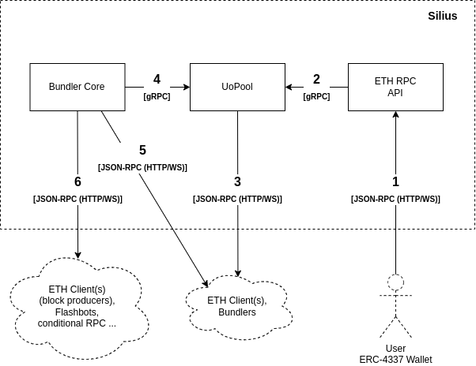

# Architecture

Silius is made up of three components:

* uopool - implementation of user operation mempool
* bundler/bundling - component that puts user operations into bundles
* RPC - implementation of RPC methods as defined in the [**specs**](https://eips.ethereum.org/EIPS/eip-4337#rpc-methods-eth-namespace)

<figure><figcaption></figcaption></figure>

One of the goals of Silius is to provide modular architecture, making it possible to run only one or more components. This means you can run only user operation mempool or bundling components. If you're wondering why this is even necessary, here are some examples:

* user operation mempool - you can run only uopool component connected to the P2P network and index user operations (no bundling and RPC needed)
* one user operation mempool and multiple bundling components - you can run a single instance of user operation mempool with multiple bundling components, each following a different bundling strategy (maybe one is focused on canonical mempool and others on alt mempools)
* all components - but you can put RPC on some cloud provider (to handle a lot of traffic), while keeping user operation mempool and bundling component on your server

More information about the architecture can be found [**here**](https://hackmd.io/@Vid201/aa-bundler-rust).

<figure><figcaption></figcaption></figure>
